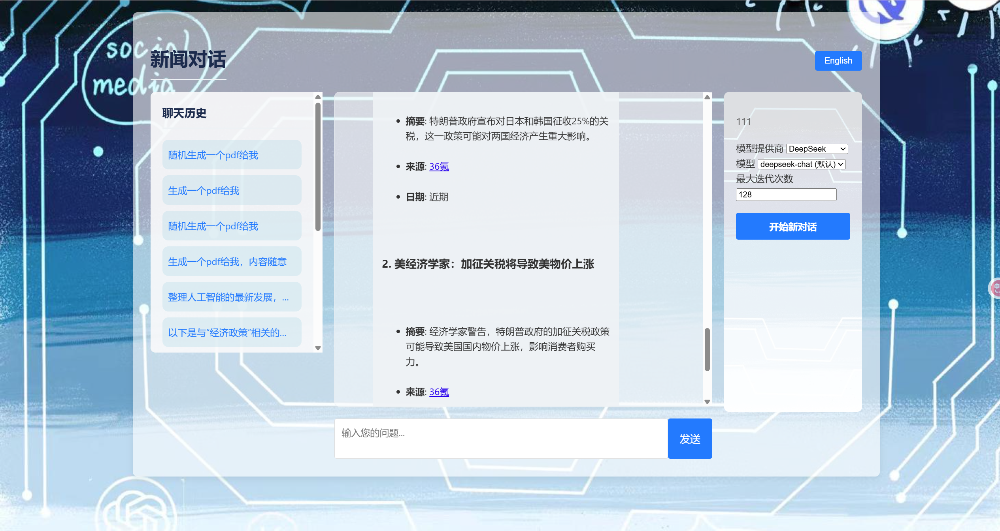

# Newsletter Generation Agent



## Project Overview

The Newsletter Generation Agent is an intelligent AI assistant that automatically gathers relevant information and generates concise, engaging, and informative newsletters based on user-specified topics. It integrates multiple information sources, including news websites, Reddit discussions, and RSS feeds, to provide a comprehensive content overview.

## Quick Start

### 1. Environment Setup

```bash
# Create and activate conda environment
conda create -n news_agent python=3.11
conda activate news_agent

# Install dependencies
pip install -r requirements.txt
```

### 2. Configure API Keys

Copy `.env.example` to `.env` and fill in the appropriate API keys:

```env
# API Keys for different model providers
OPENAI_API_KEY=your_openai_api_key_here
DEEPSEEK_API_KEY=your_deepseek_api_key_here
ZHIPU_API_KEY=your_zhipu_api_key_here
ALI_API_KEY=your_ali_api_key_here
MOONSHOT_API_KEY=your_moonshot_api_key_here

# News API
NEWS_API_KEY=your_newsapi_key_here

# Reddit API
REDDIT_CLIENT_ID=your_reddit_client_id
REDDIT_CLIENT_SECRET=your_reddit_client_secret

# SendGrid for email delivery
SENDGRID_API_KEY=your_sendgrid_api_key
FROM_EMAIL=your_sender_email@example.com
```

### 3. Start the Application

```bash
python app.py
```

The application will be available at `http://localhost:5001`.

## Core Features

1. **Multi-source Information Gathering**:
   - Fetch latest news from NewsAPI
   - Search related discussions on Reddit
   - Get professional content from RSS feeds

2. **Intelligent Content Generation**:
   - Analyze and organize information using advanced AI models (supporting OpenAI, DeepSeek, etc.)
   - Generate structured, readable newsletters

3. **Multi-turn Conversation Support**:
   - Support continuous conversation for more details
   - Maintain context memory for coherent interaction

4. **Multiple Model Selection**:
   - Support multiple AI model providers
   - Choose specific models to meet different needs

5. **Streaming Response**:
   - Display AI-generated content in real-time for better user experience

6. **Content Delivery**:
   - Send generated content via email
   - Export as PDF files

7. **Bilingual Support**:
   - Switch between Chinese and English interfaces
   - Generate content in both languages with appropriate prompts

## Tech Stack

- **Language**: Python 3.11
- **Web Framework**: Flask
- **AI Framework**: LangChain
- **Language Models**: 
  - OpenAI API (gpt-4o)
  - DeepSeek API (deepseek-chat)
  - Zhipu AI (glm-4)
  - Alibaba Cloud (qwen-max)
  - Moonshot AI (moonshot-v1-8k)
- **Data Extraction**:
  - newsapi-python (NewsAPI integration)
  - newspaper3k (web article scraping and parsing)
  - praw (Reddit API integration)
  - feedparser (RSS feed parsing)
  - beautifulsoup4 (general web content extraction)
  - requests (HTTP requests for web content)
- **Content Delivery**:
  - sendgrid (email sending)
  - weasyprint (PDF export)
- **Frontend**: HTML, CSS
- **Markdown Parsing**: Markdown library

## Usage Guide

### Usage Flow

1. **Access the Application**:
   Visit `http://localhost:5001` in your browser.

2. **Select Model**:
   - Choose AI model provider (e.g., DeepSeek, OpenAI, etc.)
   - Select specific model (e.g., gpt-4o, deepseek-chat, etc.)
   - Set maximum iterations (default is 128)

3. **Enter Topic**:
   Enter your interested news topic in the input box, such as "latest developments in artificial intelligence".

4. **View Results**:
   AI will automatically gather relevant information and generate a newsletter, with content displayed in real-time via streaming.

5. **Continue Conversation**:
   You can continue asking questions for more details, and the agent will provide coherent answers based on previous conversation history.

6. **Content Delivery**:
   - Request email delivery: "Please send this newsletter to me via email"
   - Request PDF export: "Please export this newsletter as PDF"

## Application Interface

### 1. Chat Interface
The main interface is a chat window that displays the conversation history between the user and the AI assistant.

### 2. Model Selection
The model selection form is displayed on first access, where you can select:
- Model provider (DeepSeek, OpenAI, etc.)
- Specific model (default model and other options for each provider)
- Maximum iterations (1-10)

### 3. Input Box
The input box at the bottom is used to enter questions or topics.

### 4. Start New Conversation
Click the "Start New Conversation" button to clear the history and start a new conversation.

## Common Use Cases

1. **Technology News**:
   Enter "latest developments in artificial intelligence" to get updates in the AI field.

2. **Financial News**:
   Enter "recent stock market trend analysis" to get financial market information.

3. **Academic Research**:
   Enter "latest research results in quantum computing" to get cutting-edge scientific research content.

4. **Entertainment News**:
   Enter "recent popular movies and TV shows" to get entertainment industry updates.

5. **Personalized Content**:
   Use multi-turn conversations to dive deep into specific topics.

## Development Guide

### Testing

Run tests using pytest:

```bash
# Run all tests
python -m pytest tests/ -v

# Run specific test file
python -m pytest tests/test_tools.py -v
```

### Extensibility

The project uses a modular design that's easy to extend:

1. Add new AI model providers: Add configuration in `MODEL_PROVIDERS` in `agent.py`
2. Add new tools: Create new modules in `tools/` directory and register in `agent.py`
3. Add new data sources: Implement corresponding tool functions and register with the agent
4. Enhance UI features: Modify files in `templates/` and `static/` directories

## Future Development Plans

1. **More Data Sources**:
   Integrate more types of information sources, such as Twitter and professional databases.

2. **Personalized Recommendations**:
   Provide personalized content recommendations based on user history preferences.

3. **Mobile Adaptation**:
   Optimize user experience for mobile devices.

4. **Scheduled Sending**:
   Support scheduled automatic newsletter delivery.

5. **Multilingual Support**:
   Extend support for more languages in content generation.

## Important Notes

1. **API Keys**:
   Ensure all required API keys are correctly configured, otherwise related functions will not work.

2. **Network Connection**:
   The application requires a stable network connection to access external APIs.

3. **Model Limitations**:
   Different AI models have different capabilities and limitations. Choosing the right model can yield better results.

4. **Privacy Protection**:
   The application does not store user conversation content. All information is only kept in memory during the session.

5. **Content Accuracy**:
   AI-generated content is based on gathered information and may be inaccurate or outdated. Please refer to official information.

## Documentation

Detailed technical documentation:
- [Technical Documentation](TECHNICAL_DOCUMENTATION.md)
- [Application Documentation](APPLICATION_DOCUMENTATION.md)
- [Development Guide](DEVELOPER_STYLE_GUIDE.md)
- [Project Plan](plan.md)

## Troubleshooting

1. **Unable to Start Application**:
   - Check if all dependencies are installed
   - Confirm environment variables are correctly configured

2. **API Call Failures**:
   - Check if API keys are correct
   - Confirm network connection is normal

3. **Model Selection Invalid**:
   - Check if the selected model is supported
   - Confirm API key matches the model provider

4. **Streaming Response Interrupted**:
   - Check network connection
   - Reduce maximum iteration settings

5. **Content Delivery Failed**:
   - Check SendGrid API key and sender email configuration
   - Confirm wkhtmltopdf is installed (required for PDF export)